<p align="center">
  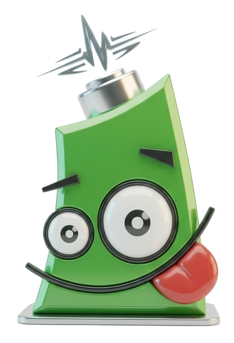
</p>

# Pilas3D-Engine

Motor de videojuegos 3D simple y en español, inspirado en
[pilas-engine](https://www.pilas-engine.com.ar/) 1.x de Hugo Ruscitti
([código original](https://github.com/pilas-engine/pilas-engine)).
Mantiene su filosofía y API didáctica, pero reemplaza el
render 2D (QPainter/PyQt4) por OpenGL 3D usando **pyglet**.

[](https://buymeacoffee.com/lukasgaleano)

```python
import pilas3d

pilas = pilas3d.iniciar()

mono = pilas.actores.Mono()
mono.aprender(pilas.habilidades.MoverseConElTeclado)
pilas.actores.Piso()
pilas.actores.Cielo()
pilas.ejecutar()
```

## Herramientas

Todo se instala con `pip install -e .` (o el instalador) y queda como
comando:

| Comando | Herramienta | |
|---|---|---|
| `pilas3d` | **Consola interactiva**: ventana 3D + IPython — cada línea refresca la escena | `%ejemplo`, `%ia`, `%make_game` |
| `pilas3d-ide` | **IDE integrado**: vista 3D + consola Python en la misma ventana | multilínea, historial, `Ctrl+S` guarda |
| `pilas3d-editor` | **Editor de personajes**: posar huesos `.glb`, keyframes, animar | guarda `.anim.json` |
| `pilas3d-bloques` | **Blockly web**: bloques tipo Scratch → Python real | ejemplos precargados, Run/Stop |
| `pilas3d-mapas` | **Editor de mapas voxel**: click pone bloques, paleta, spawn | guarda `.mapa.json` |

### Editor de personajes (`pilas3d-editor`)

| Huesos y pose | Modelo Fox | Explorador de .glb |
|---|---|---|
| 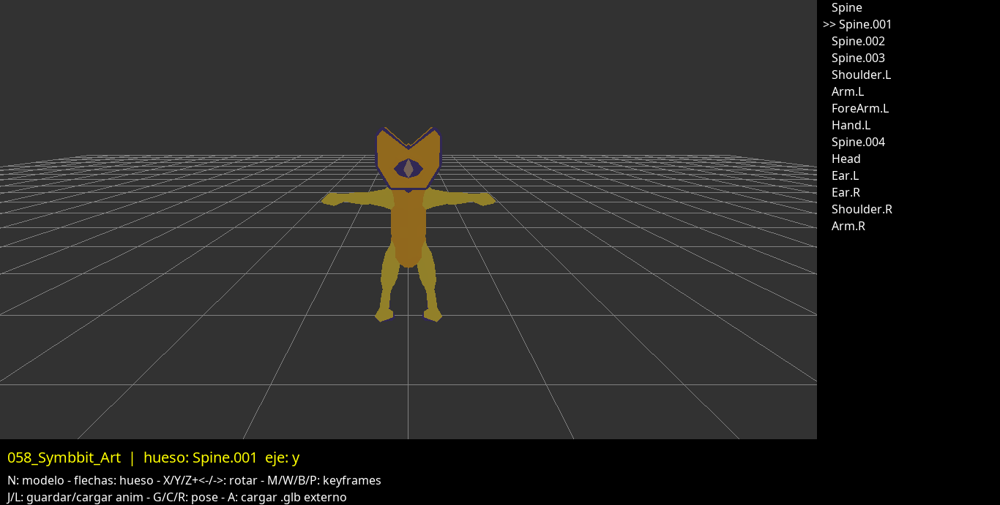 | 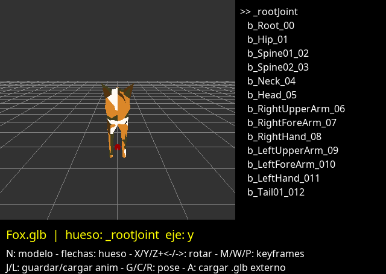 | 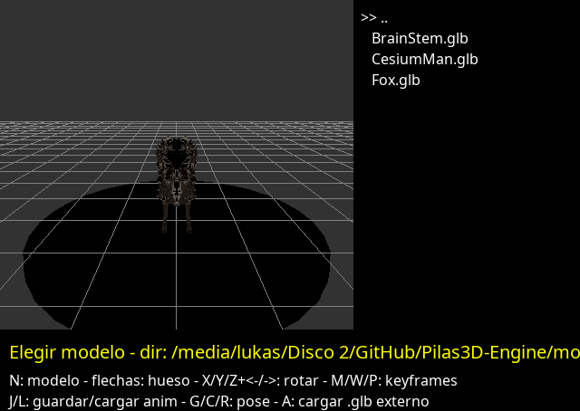 |

Carga modelos `.glb` riggeados: rotar/mover huesos, capturar
keyframes, crear animaciones propias guardadas como `.anim.json`
junto al modelo — sin Blender. Guía:
[docs/editor-personaje.md](docs/editor-personaje.md).

### Programación por bloques (`pilas3d-bloques`)

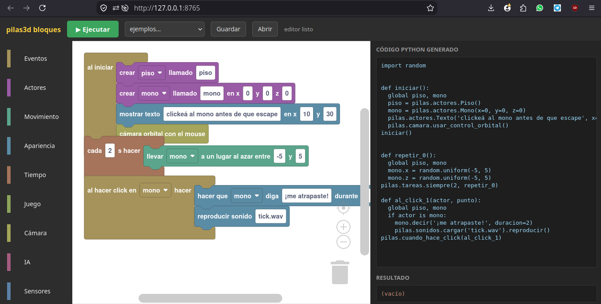

Arrastrar bloques tipo Scratch genera **código Python real** en el
panel lateral, que corre en la escena al apretar Ejecutar: actores,
eventos (click, tecla, colisión, entrar a zona), movimiento,
interpolaciones, menús, variables, IA (`Cerebro`, `Chat`), vida,
zonas, patrullas. Puente de bloques a código. Guía:
[docs/bloques.md](docs/bloques.md).

### Editor de mapas (`pilas3d-mapas`)

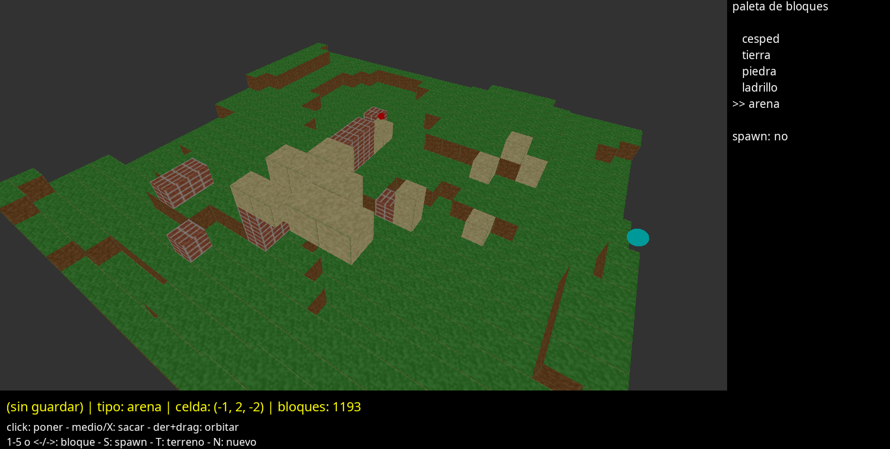

Editor voxel con paleta de bloques y spawn del jugador. Los juegos
cargan los `.mapa.json` con `pilas.mapas.cargar()`. Guía:
[docs/mapas.md](docs/mapas.md).

### Consola interactiva (`pilas3d`)

Ventana 3D + consola IPython (autocompletado, historial) donde
`pilas` ya está iniciada y **cada línea refresca la escena**:

```
In [1]: cubo = pilas.actores.Cubo()        # aparece al instante
In [2]: cubo.color = pilas.colores.rojo    # se vuelve rojo
In [3]: %ejemplo templo                    # corre un ejemplo acá mismo
In [4]: %ia ¿cómo pongo gravedad?          # asistente (opcional)
In [5]: %ia make_game un cubo que salta    # genera un juego entero
```

## Capturas

| PilasCraft (día) | PilasCraft (noche) | Mini Doom |
|---|---|---|
| 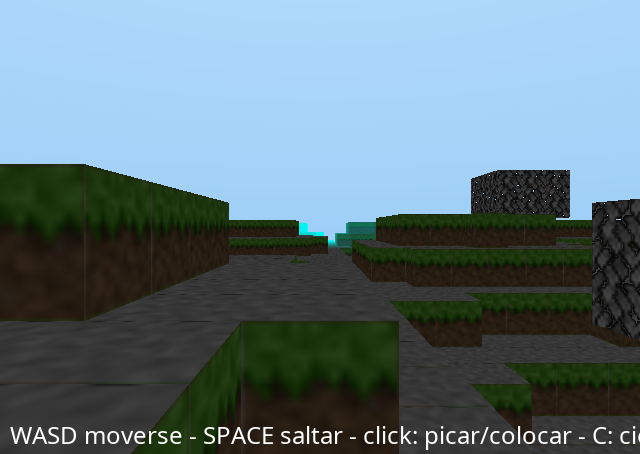 | 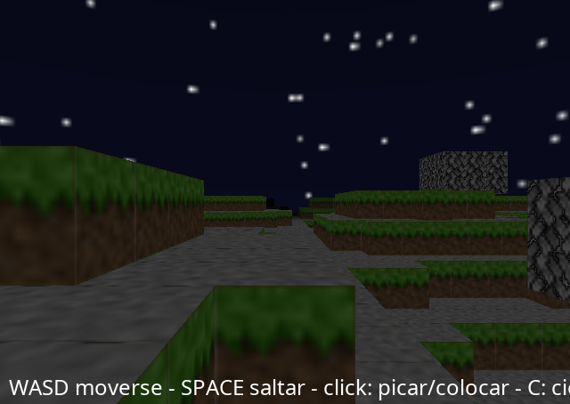 | 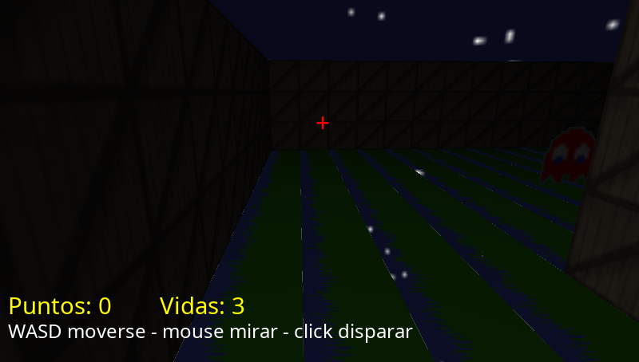 |

| Menú | Bots | Niebla |
|---|---|---|
| 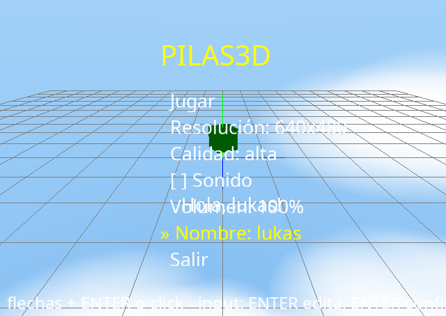 | 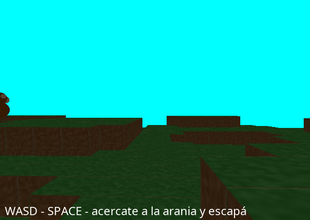 | 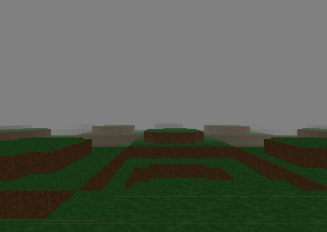 |

| Multijugador | Modelos Minecraft | Partículas |
|---|---|---|
| 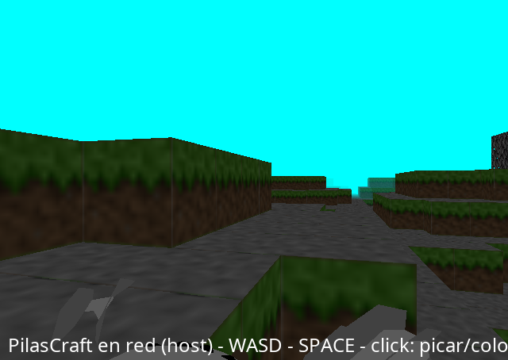 | 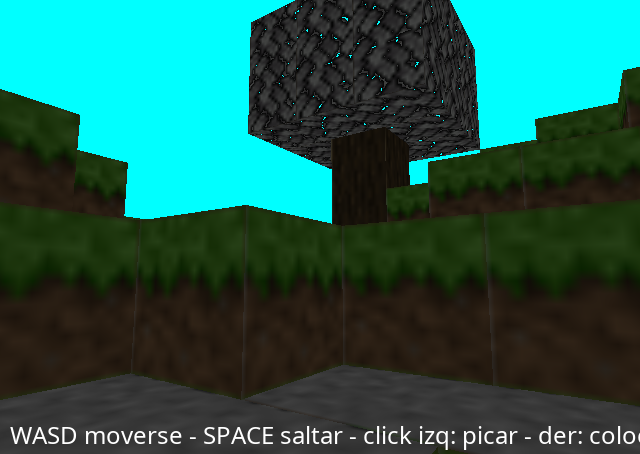 | 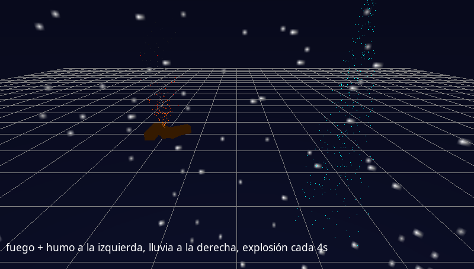 |

Más en [`capturas/`](capturas/).

## Instalación

```bash
./instalar.sh          # Linux / macOS
instalar.bat           # Windows (doble click o desde cmd)
```

o a mano:

```bash
python3 -m venv .venv
.venv/bin/pip install -r requirements.txt
.venv/bin/pip install -e .
```

Para **actualizar** a la última versión:

```bash
./actualizar.sh        # Linux / macOS
actualizar.bat         # Windows
```

Baja los cambios con `git pull --tags` y reinstala dependencias. La
versión actual está en el archivo `VERSION` y cada entrega queda
registrada con un tag de Git (`v0.2.0`, …).

### Asistente de IA (opcional)

Los instaladores descargan el binario de [Ollama](https://ollama.com)
(~200 MB) a `pilas3d/_vendor/` — si ya tenés Ollama instalado se usa
ese — y ofrecen elegir el modelo del asistente (default:
`qwen2.5-coder:0.5b`, ~500 MB, corre en CPU). Si lo salteás, el modelo
se baja solo la primera vez que consultás, y después todo corre
**local y offline**.

Para instalar/cambiar el modelo más tarde:

```bash
.venv/bin/python -m pilas3d.ia --lista                 # catálogo
.venv/bin/python -m pilas3d.ia qwen2.5-coder:7b        # baja otro
.venv/bin/python -m pilas3d.ia --instalados            # los que tenés
.venv/bin/python -m pilas3d.ia borrar qwen2.5-coder:0.5b  # libera espacio
PILAS3D_IA_MODELO=qwen2.5-coder:7b .venv/bin/pilas3d   # usarlo
```

```python
pilas.ayuda()                                   # chuleta clásica
pilas.ayuda("¿cómo hago un enemigo que me persiga?")
pilas.ia.preguntar("¿y si le agrego una lámpara?")
# en la consola interactiva:
In [1]: %ia ¿cómo pongo gravedad?
In [2]: %explicar        # explica el último error
```

El NPC con habilidad `Cerebro` decide sus acciones con el LLM local
(`acercarse`, `decir`, `ir_a`…) y el actor `Chat` sirve tanto para
hablarle al NPC como de **chat entre jugadores** cuando hay una
conexión de `pilas.red` activa — los mensajes llegan a un log en
pantalla. Sin Ollama el motor funciona igual: `pilas.ayuda()` sigue
mostrando la guía. Variables: `PILAS3D_IA_MODELO`, `PILAS3D_IA_GPU=1`.
Guía completa: [docs/asistente-ia.md](docs/asistente-ia.md).

## Ejemplos

```bash
.venv/bin/python ejemplos/hola_cubo.py
.venv/bin/python ejemplos/templo.py             # juego completo: vida, enemigos, zonas, monedas, guardar
.venv/bin/python ejemplos/mover_con_teclado.py  # flechas o WASD
.venv/bin/python ejemplos/juego_recolectar.py   # mini-juego completo
.venv/bin/python ejemplos/camara_orbital.py     # órbita con mouse + debug
.venv/bin/python ejemplos/juego_doom.py         # mini-FPS: WASD + mouse + click
.venv/bin/python ejemplos/antorchas.py          # noche con lámparas parpadeantes
.venv/bin/python ejemplos/sonido.py             # efectos de audio
.venv/bin/python ejemplos/modelo_animado.py     # modelos .obj animados
.venv/bin/python ejemplos/escenas.py            # menu -> juego (escenas)
.venv/bin/python ejemplos/pilascraft.py         # mundo voxel infinito, picar/colocar
.venv/bin/python ejemplos/pilascraft_red.py     # PilasCraft multijugador
.venv/bin/python ejemplos/juego_modelos.py      # recolectar gemas con modelos .obj
.venv/bin/python ejemplos/plataformas.py        # plataformero: PisaPlataformas + salto
.venv/bin/python ejemplos/particulas.py         # fuego, humo, lluvia, explosión
.venv/bin/python ejemplos/personajes.py         # galería: Robot, Humanoide, Mono, Arania, Espectro
.venv/bin/python ejemplos/bots.py               # NPCs: patrullan, te persiguen (SerBot)
.venv/bin/python ejemplos/cerebro.py            # NPC con Cerebro: decide con el LLM local
.venv/bin/python ejemplos/niebla.py             # escena.niebla: abierta/cerrada/noche
.venv/bin/python ejemplos/vida_y_zonas.py       # Vida + Zona + máquina de estados + Barra
```

## Modo interactivo manual

También se puede usar `paso()` desde cualquier REPL o script sin
bloquear con `ejecutar()`:

```python
>>> import pilas3d
>>> pilas = pilas3d.iniciar()
>>> cubo = pilas.actores.Cubo()      # la ventana ya muestra la escena
>>> cubo.color = pilas.colores.rojo
>>> pilas.paso()                     # redibuja con el cambio
>>> for i in range(180):             # anima ~3 segundos
...     cubo.rotacion_y += 2
...     pilas.paso()
```

## Tests

```bash
.venv/bin/python -m pytest tests/
```

## Mapa con pilas-engine 1.4.9

| pilas (2D)                    | pilas3d                              |
|-------------------------------|--------------------------------------|
| `pilasengine.iniciar()`       | `pilas3d.iniciar()`                  |
| `pilas.actores.Aceituna()`    | `pilas.actores.Cubo()` / `Esfera()`… |
| `actor.x`, `actor.y`          | `actor.x`, `actor.y`, `actor.z` real |
| `actor.rotacion`              | `rotacion_x/y/z` (`rotacion` = eje Y)|
| `pilas.escenas.Normal()`      | igual + `escenas.vincular(Clase)`, hooks `iniciar`/`terminar`/`cuando_pulsa_tecla`, `pilas.escena`, `pilas.cambiar_escena` |
| `escena.camara.x/y`           | `camara.x/y/z` + `camara.objetivo`   |
| `pilas.control.izquierda`…    | igual (flechas + WASD)               |
| `pilas.actores.Texto/Puntaje` | `pilas.actores.Texto()` / `Puntaje()` (overlay 2D, multilínea) |
| —                             | `pilas.actores.Panel()` + `pilas.ventana.area_3d` (HUD/paneles) |
| `actor.colisiona_con(otro)`   | igual (esfera-esfera 3D) + `colisiona_en_plano_con` (XZ) |
| —                             | `pilas.colisiones.cuando_colisionan(a, b, fn)` — evento de colisión |
| `pilas.tareas.siempre(s, f)`  | igual (`una_vez`, `siempre`, `condicional`)  |
| `actor.x = [100]`             | igual — interpolación + `pilas.interpolar(actor, 'x', v, duracion, tipo=…)` |
| `actor.aprender(habilidades.X)` | igual — `MoverseConElTeclado`, `SerBot`, `PerseguirAOtroActor` (A*), `Patrullar`, `HuirDe`, `Vida`, `MaquinaDeEstados`, `PisaPlataformas` (salto+gravedad), `RebotaEnParedes`, `Parpadear`, `Cerebro` (LLM)… |
| `pilas.depurador.definir_modos` | `fps`, `ejes`, `radios_de_colision`, `puntos_de_control` |
| `pilas.fps.ver()`             | igual                                |
| —                             | `pilas.camara.seguir_a(actor, modo)` 1ra/2da/3ra persona, `usar_control_orbital()`, `temblor()` |
| —                             | `habilidades.CaminarEnPrimeraPersona` (FPS: mouse look + WASD) |
| —                             | `pilas.actores.Pared()` + `escena.obstaculos` (bloquean el paso) |
| `pilas.control.mouse_x/y`     | posición y botones + `pilas.cuando_hace_click(f)` → `f(actor, punto)` |
| `habilidades.Arrastrable`…    | `Arrastrable` (drag 3D), `SeguirAlMouse` |
| `habilidades.Disparar`        | igual — `actor.disparar()`, `con_click`, `cuando_impacta` |
| —                             | `pilas.actores.Menu()` — menú overlay navegable |
| —                             | `pilas.actores.Lampara()` — luz puntual que sigue al actor |
| —                             | `pilas.actores.Zona()` — trigger: `cuando_entra`/`cuando_sale` |
| —                             | `pilas.actores.Barra(de=actor)` — barra de vida del HUD |
| —                             | `pilas.eventos.cuando/emitir` — bus de eventos propios |
| —                             | `pilas.guardar_partida`/`cargar_partida` — JSON |
| `pilas.sonidos.cargar()`      | igual + `pilas.sonidos.volumen`/`.mute` |
| `pilas.musica.cargar()`       | igual (streaming, bucle por defecto) |
| `Grilla`/`Animacion`          | `pilas.actores.Animacion(img, columnas, filas)` (billboard) |
| —                             | `Cartel()`, `Sombra()`, `Cielo()`, `Globo()`, `Chat()` |
| —                             | `ModeloGLTF('x.glb')` — glTF 2.0 con skinning por CPU, `.animar()`, poses y keyframes propios (ver [docs/modelos-rendimiento.md](docs/modelos-rendimiento.md)) |
| —                             | `Mundo()` — voxels tipo Minecraft; `ModeloJSON()` bloques |
| —                             | `pilas.luces` — sol + hasta 8 puntuales; `escena.niebla` |
| —                             | `pilas.red.hospedar/conectar` — multijugador simple |
| `Mono`/`Robot`/...            | `Robot`/`Humanoide`/`Mono`/`Arania`/`Espectro` + `Bot()` |
| `pilas.ejecutar()`            | `pilas.ejecutar()`                   |

## Colaborar

¡Las contribuciones son bienvenidas! Algunas formas de sumar:

- **Issues y PRs**: reportá bugs, proponé habilidades o actores nuevos,
  mejorá ejemplos o documentación.
- **Ideas pendientes**: transiciones con fade entre escenas, lanzador
  gráfico de ejemplos, shadow mapping real (hoy `Sombra` es un blob),
  materiales glTF completos, skinning en GPU, más habilidades de pilas.
- **Ejemplos**: un nuevo juego o demo usando la API es una gran
  contribución — mirá `ejemplos/` para el estilo.

Antes de commitear corré los tests:

```bash
.venv/bin/python -m pytest tests/
```

### Apoyar el proyecto

Si el motor te resulta útil y querés darle una mano al desarrollo,
podés invitarme un café:

[](https://buymeacoffee.com/lukasgaleano)

**[buymeacoffee.com/lukasgaleano](https://buymeacoffee.com/lukasgaleano)**

## Licencia

LGPLv3, igual que el proyecto original.

El binario de Ollama (licencia MIT, © Ollama) **no** se distribuye con
este repositorio: los instaladores lo descargan aparte a
`pilas3d/_vendor/`, que está en `.gitignore`.
